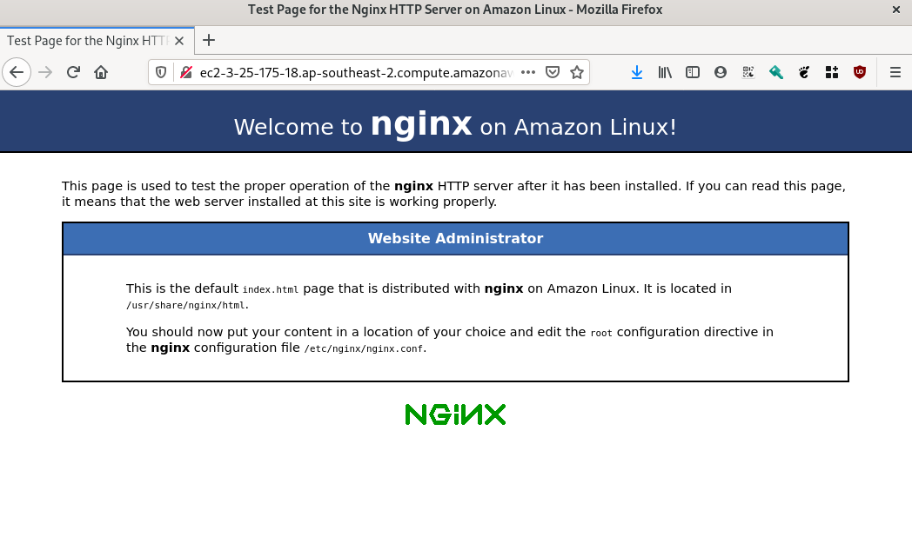

# Level 100 AWS EC2 test

The unlikely remit is to bring up a web site (very simple, just basic nginx) as a publically accessible web site, with an attached data volume for later use.

There are several problems with this stack. Review the requirements below and fork and make a PR for your solution.

> Don't forget to remove any cost incurring AWS resources after your interview!

## How to ask a question

If you have any questions about this challenge, create an issue in the GitHub repostitory.

## Requirements

1. Amazon Linux 2 EC2 instance
1. Publicly accessible Nginx website
1. Mounted data volume for later use
1. Deploy twice, to Sydney region and Mumbai region

## Deployment instructions:

Set up your AWS environement. The deployment script requires you have Docker (or podman) working locally and uses [Stackup](https://github.com/realestate-com-au/stackup), and you will need to have these env vars set, granting appropriate access to carry out the actions of the deployment:

- `AWS_DEFAULT_REGION`
- `AWS_SECRET_ACCESS_KEY`
- `AWS_ACCESS_KEY_ID`

If you are using federated identity, you may also need this:

- `AWS_SESSION_TOKEN`

```bash
bin/010_deploy_resources.sh
```

A working solution will result in two published websites (one in Sydney region, and one in Mumnbai region). This is a screenshot of a successfull Sydney region deployment:



## Clean up!

Don't forget to clean up any AWS resources!